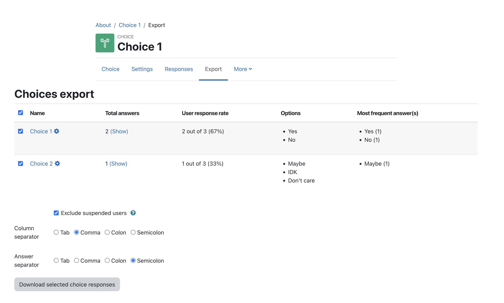

# Choices export - Moodle local plugin

A simple Moodle local plugin that allows teachers
to overview all Choice activities in a course,
check the response rate and export all Choices
along with their students' answers to a text file.

Tested in: Moodle 4.0

## Quick install

Download zip package, extract to a folder and upload this folder
into `local` directory.

## Changelog

- Version 2022081400
    - Compatibility with Moodle 4.0

## About

Developed by: Kacper Rokicki <k.k.rokicki@gmail.com>

GIT: https://github.com/k-rokicki/moodle-local_choicesexport
